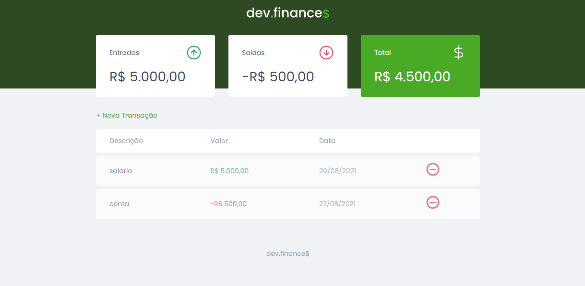

# DEV FINANCE.

## Descrição do Projeto
<p>O DEV FINANCE é uma plataforma para controlar seus ganhos e gastos financeiros.</p>

<h2>Demonstração da aplicação</h2>

<div>
  
</div>

## 🎲 Rodando o Front End

```bash
# Clone este repositório
$ git clone <https://github.com/Bruno-Cesar123/dev_finance>

# Acesse a pasta do projeto no terminal/cmd
$ cd dev_finance
```

<p> Abra o arquino index.html no seu navegador para iniciar a aplicação</p>

## 🛠 Tecnologias

<p>As seguintes ferramentas foram usadas na construção do projeto:</p>

<div>
  <ul>
    <li style="list-style: none"> <a href="https://developer.mozilla.org/pt-BR/docs/Web/JavaScript"> <strong>JavaScript</strong> </a></li>
    <li style="list-style: none"> <a href="https://developer.mozilla.org/pt-BR/docs/Web/CSS"> <strong>CSS</strong> </a></li>
    <li style="list-style: none"> <a href="https://developer.mozilla.org/pt-BR/docs/Web/HTML"> <strong>HTML</strong> </a></li>
  </ul>
  </ul>
</div>

## 📝 Licença

<p>Este projeto esta sobe a licença MIT.</p>

<p>Feito por <strong>Bruno Cesar</strong> <a href="https://www.linkedin.com/in/bruno-cesar-b0039715a/">Linkedin</a>
